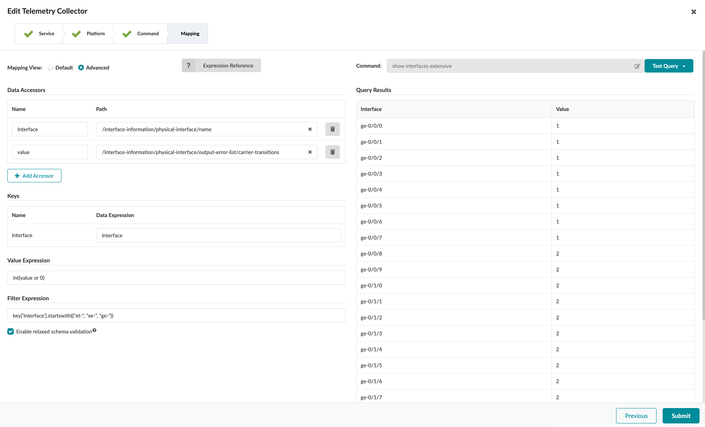
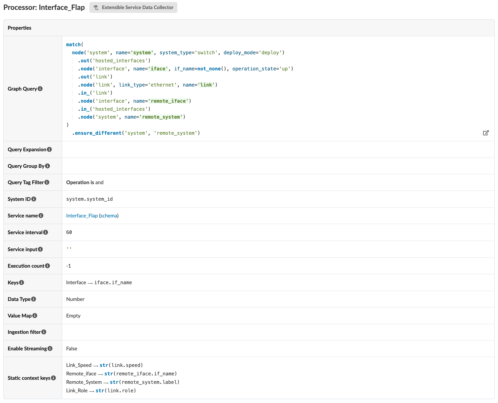
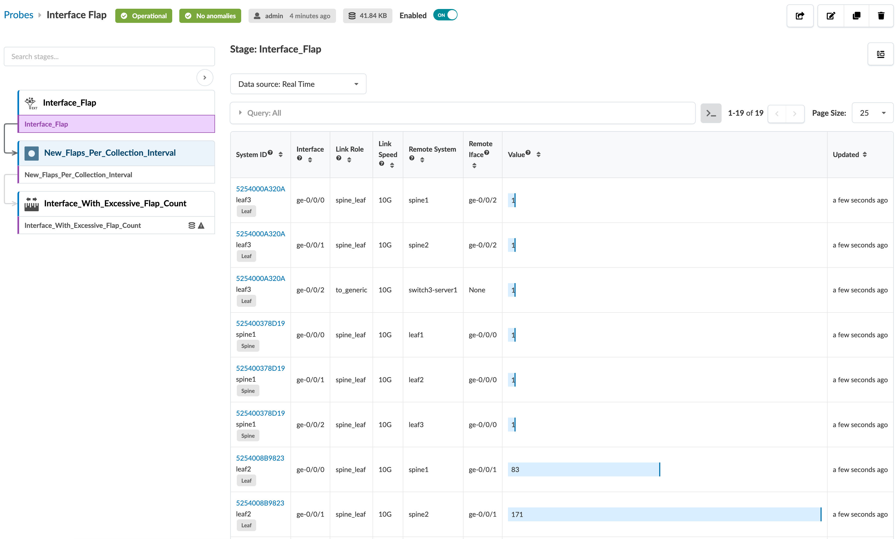
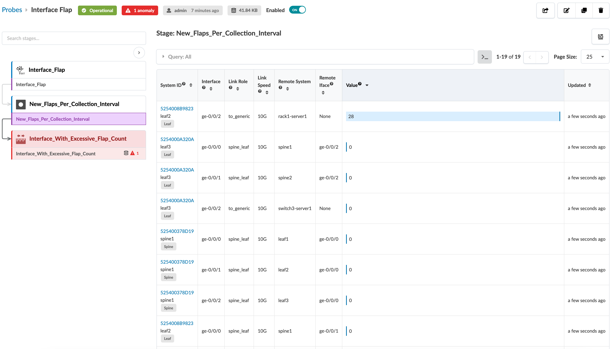
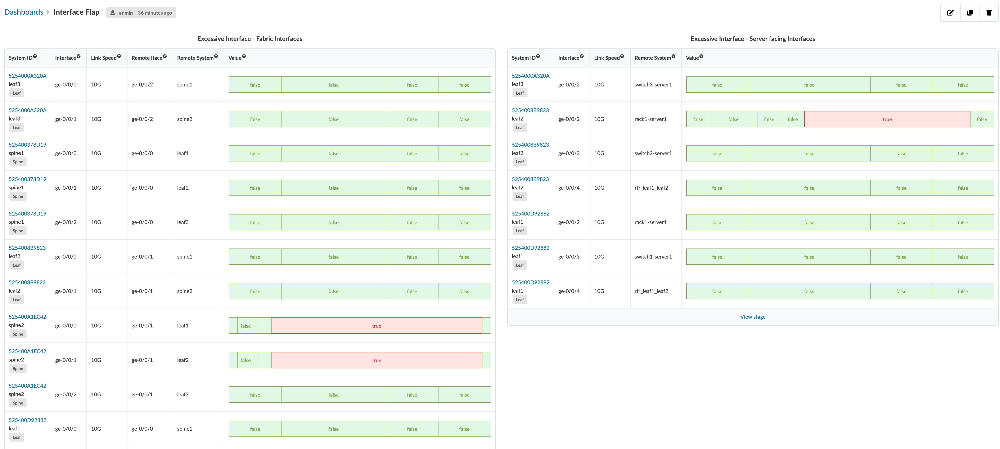

# Interface Flap

Table of Contents:
- [Interface Flap](#interface-flap)
  - [Description of the use-case](#description-of-the-use-case)
  - [Identification of the source data (raw data)](#identification-of-the-source-data-raw-data)
  - [Content](#content)
    - [Configlets](#configlets)
    - [Property Sets](#property-sets)
    - [Telemetry Service Schema](#telemetry-service-schema)
    - [Telemetry Collectors](#telemetry-collectors)
    - [Probes](#probes)
      - [Probe pipeline structure](#probe-pipeline-structure)
      - [Probe processors details](#probe-processors-details)
    - [Widgets](#widgets)
    - [Dashboards](#dashboards)

<br>

## Description of the use-case

- Monitor interfaces flaps and raise anomalies if an interface flaps more than "replace-with-your-expectaitons" times betwen two collection intervals.
- For the context, there is a predefined probe called `Interface Flaps` wich consumes `interface` built-in telemetry service. However that probe has a known issue whereby it can in some situaitons miss reporting some flaps. That known issue will be addressed by moving the `interface` service form poll-based to a push-based approach with gNMI. Meanwhile, the probe described in this page is an example at addressing the issue by staying on a poll-based approach but using a different CLI command.

<br>

## Identification of the source data (raw data)
- CLI Command: `show interface extensive` - [Junos documentation page](https://www.juniper.net/documentation/us/en/software/junos/interfaces-ethernet-switches/topics/ref/command/show-interfaces-extensive.html). 
- Sample Text Output:
```
Physical interface: gr-0/0/0, Enabled, Physical link is Up
  Interface index: 645, SNMP ifIndex: 503, Generation: 136
  Type: GRE, Link-level type: GRE, MTU: Unlimited, Speed: 800mbps
  Hold-times     : Up 0 ms, Down 0 ms
  Device flags   : Present Running
  Interface flags: Point-To-Point SNMP-Traps
  Statistics last cleared: Never
  Traffic statistics:
   Input  bytes  :                    0                    0 bps
   Output bytes  :                    0                    0 bps
   Input  packets:                    0                    0 pps
   Output packets:                    0                    0 pps
   IPv6 transit statistics:
   Input  bytes  :                    0
   Output bytes  :                    0
   Input  packets:                    0
   Output packets:                    0

Physical interface: pfe-0/0/0, Enabled, Physical link is Up
  Interface index: 648, SNMP ifIndex: 505, Generation: 139
  Type: Unspecified, Link-level type: Unspecified, MTU: 0, Clocking: Unspecified, Speed: 800mbps
  Device flags   : Present Running
  Link type      : Unspecified
  Link flags     : None
  Physical info  : Unspecified
  Hold-times     : Up 0 ms, Down 0 ms
  Current address: Unspecified, Hardware address: Unspecified
  Alternate link address: Unspecified
  Last flapped   : Never
  Statistics last cleared: Never
  Traffic statistics:
   Input  bytes  :                    0
   Output bytes  :                    0
   Input  packets:                    0
   Output packets:                    0
   IPv6 transit statistics:
   Input  bytes  :                    0
   Output bytes  :                    0
   Input  packets:                    0
   Output packets:                    0
  Input errors:
    Errors: 0, Drops: 0, Framing errors: 0, Runts: 0, Giants: 0, Policed discards: 0, Resource errors: 0
  Output errors:
    Carrier transitions: 0, Errors: 0, Drops: 0, MTU errors: 0, Resource errors: 0
...
<truncated>
...
Physical interface: et-0/0/24, Enabled, Physical link is Up
  Interface index: 649, SNMP ifIndex: 550, Generation: 140
  Description: to.fw
  Link-level type: Ethernet, MTU: 9216, LAN-PHY mode, Speed: 40Gbps, BPDU Error: None, Loop Detect PDU Error: None, Ethernet-Switching Error: None, MAC-REWRITE Error: None, Loopback: Disabled, Source filtering: Disabled, Flow control: Disabled, Media type: Fiber
  Device flags   : Present Running
  Interface flags: SNMP-Traps Internal: 0x4000
  Link flags     : None
  CoS queues     : 8 supported, 8 maximum usable queues
  Hold-times     : Up 0 ms, Down 0 ms
  Current address: 80:ac:ac:2a:d7:d1, Hardware address: 80:ac:ac:2a:cf:06
  Ethernet segment value: 00:02:00:00:00:00:03:00:00:03, Mode: all-active
  Last flapped   : 2023-10-16 16:52:59 CEST (8w6d 17:24 ago)
  Statistics last cleared: Never
  Traffic statistics:
   Input  bytes  :            917594392                 1024 bps
   Output bytes  :       32313742686802              2688192 bps
   Input  packets:              7187555                    1 pps
   Output packets:          29695303198                 4463 pps
   IPv6 transit statistics:
   Input  bytes  :                    0
   Output bytes  :                    0
   Input  packets:                    0
   Output packets:                    0
  Input errors:
    Errors: 0, Drops: 0, Framing errors: 0, Runts: 0, Policed discards: 0, L3 incompletes: 0, L2 channel errors: 0, L2 mismatch timeouts: 0, FIFO errors: 0, Resource errors: 0
  Output errors:
    Carrier transitions: 3, Errors: 0, Drops: 0, Collisions: 0, Aged packets: 0, FIFO errors: 0, HS link CRC errors: 0, MTU errors: 0, Resource errors: 0
  Egress queues: 8 supported, 4 in use
  Queue counters:       Queued packets  Transmitted packets      Dropped packets
    0                      29689243233          29689243233                    0
    3                                0                    0                    0
    4                                0                    0                    0
    7                          6059698              6059698                    0
  Queue number:         Mapped forwarding classes
    0                   best-effort
    3                   fcoe
    4                   no-loss
    7                   network-control
  Active alarms  : None
  Active defects : None
  PCS statistics                      Seconds
    Bit errors                             1
    Errored blocks                         1
  Ethernet FEC statistics              Errors
    FEC Corrected Errors                    0
    FEC Uncorrected Errors                  0
    FEC Corrected Errors Rate               0
    FEC Uncorrected Errors Rate             0
  MAC statistics:                      Receive         Transmit
    Total octets                     917594392   32313742686802
    Total packets                      7187555      29695303198
    Unicast packets                    1172711      29689261892
    Broadcast packets                   406367               73
    Multicast packets                  5608477          6041233
    CRC/Align errors                         0                0
    FIFO errors                              0                0
    MAC control frames                       0                0
    MAC pause frames                         0                0
    Oversized frames                         0
    Jabber frames                            0
    Fragment frames                          0
    VLAN tagged frames                 1579078
    Code violations                          0
  MAC Priority Flow Control Statistics:
    Priority :  0                             0                0
    Priority :  1                             0                0
    Priority :  2                             0                0
    Priority :  3                             0                0
    Priority :  4                             0                0
    Priority :  5                             0                0
    Priority :  6                             0                0
    Priority :  7                             0                0
  PRBS Mode : Disabled
  Packet Forwarding Engine configuration:
    Destination slot: 0 (0x00)
  CoS information:
    Direction : Output
    CoS transmit queue               Bandwidth               Buffer Priority   Limit
                              %            bps     %           usec
    0 best-effort            15     6000000000    15              0      low    none
    3 fcoe                   35    14000000000    35              0      low    none
    4 no-loss                35    14000000000    35              0      low    none
    7 network-control        15     6000000000    15              0      low    none
  Interface transmit statistics: Disabled
  MACSec statistics:
    Output
        Secure Channel Transmitted
        Protected Packets               : 0
        Encrypted Packets               : 0
        Protected Bytes                 : 0
        Encrypted Bytes                 : 0
     Input
        Secure Channel Received
        Accepted Packets                : 0
        Validated Bytes                 : 0
        Decrypted Bytes                 : 0
...
<truncated>
...
```
<details>
    <summary>Sample XML Output:</summary>

```xml
<rpc-reply xmlns:junos="http://xml.juniper.net/junos/22.4R0/junos">
    <interface-information xmlns="http://xml.juniper.net/junos/22.4R0/junos-interface" junos:style="normal">
        <physical-interface>
            <name>gr-0/0/0</name>
            <admin-status junos:format="Enabled">up</admin-status>
            <oper-status>up</oper-status>
            <local-index>645</local-index>
            <snmp-index>503</snmp-index>
            <generation>136</generation>
            <if-type>GRE</if-type>
            <link-level-type>GRE</link-level-type>
            <mtu>Unlimited</mtu>
            <speed>800mbps</speed>
            <up-hold-time>0</up-hold-time>
            <down-hold-time>0</down-hold-time>
            <if-device-flags>
                <ifdf-present/>
                <ifdf-running/>
            </if-device-flags>
            <ifd-specific-config-flags>
            </ifd-specific-config-flags>
            <if-config-flags>
                <iff-point-to-point/>
                <iff-snmp-traps/>
            </if-config-flags>
            <statistics-cleared>Never</statistics-cleared>
            <traffic-statistics junos:style="verbose">
                <input-bytes>0</input-bytes>
                <input-bps>0</input-bps>
                <output-bytes>0</output-bytes>
                <output-bps>0</output-bps>
                <input-packets>0</input-packets>
                <input-pps>0</input-pps>
                <output-packets>0</output-packets>
                <output-pps>0</output-pps>
                <ipv6-transit-statistics>
                    <input-bytes>0</input-bytes>
                    <output-bytes>0</output-bytes>
                    <input-packets>0</input-packets>
                    <output-packets>0</output-packets>
                </ipv6-transit-statistics>
            </traffic-statistics>
        </physical-interface>
        <physical-interface>
            <name>pfe-0/0/0</name>
            <admin-status junos:format="Enabled">up</admin-status>
            <oper-status>up</oper-status>
            <local-index>648</local-index>
            <snmp-index>505</snmp-index>
            <generation>139</generation>
            <if-type>Unspecified</if-type>
            <link-level-type>Unspecified</link-level-type>
            <mtu>0</mtu>
            <speed>800mbps</speed>
            <clocking>Unspecified</clocking>
            <if-device-flags>
                <ifdf-present/>
                <ifdf-running/>
            </if-device-flags>
            <ifd-specific-config-flags>
            </ifd-specific-config-flags>
            <if-config-flags>
            </if-config-flags>
            <link-type>Unspecified</link-type>
            <if-media-flags>
                <ifmf-none/>
            </if-media-flags>
            <physical-information>Unspecified</physical-information>
            <up-hold-time>0</up-hold-time>
            <down-hold-time>0</down-hold-time>
            <current-physical-address>Unspecified</current-physical-address>
            <hardware-physical-address>Unspecified</hardware-physical-address>
            <alternate-physical-address>Unspecified</alternate-physical-address>
            <interface-flapped junos:seconds="0">Never</interface-flapped>
            <statistics-cleared>Never</statistics-cleared>
            <traffic-statistics junos:style="verbose">
                <input-bytes>0</input-bytes>
                <output-bytes>0</output-bytes>
                <input-packets>0</input-packets>
                <output-packets>0</output-packets>
                <ipv6-transit-statistics>
                    <input-bytes>0</input-bytes>
                    <output-bytes>0</output-bytes>
                    <input-packets>0</input-packets>
                    <output-packets>0</output-packets>
                </ipv6-transit-statistics>
            </traffic-statistics>
            <input-error-list>
                <input-errors>0</input-errors>
                <input-drops>0</input-drops>
                <framing-errors>0</framing-errors>
                <input-runts>0</input-runts>
                <input-giants>0</input-giants>
                <input-discards>0</input-discards>
                <input-resource-errors>0</input-resource-errors>
            </input-error-list>
            <output-error-list>
                <carrier-transitions>0</carrier-transitions>
                <output-errors>0</output-errors>
                <output-drops>0</output-drops>
                <mtu-errors>0</mtu-errors>
                <output-resource-errors>0</output-resource-errors>
            </output-error-list>
        <physical-interface>
            <name>et-0/0/24</name>
            <admin-status junos:format="Enabled">up</admin-status>
            <oper-status>up</oper-status>
            <local-index>649</local-index>
            <snmp-index>550</snmp-index>
            <generation>140</generation>
            <description>to.fw</description>
            <link-level-type>Ethernet</link-level-type>
            <mtu>9216</mtu>
            <sonet-mode>LAN-PHY</sonet-mode>
            <source-filtering>disabled</source-filtering>
            <speed>40Gbps</speed>
            <eth-switch-error>none</eth-switch-error>
            <bpdu-error>none</bpdu-error>
            <ld-pdu-error>none</ld-pdu-error>
            <l2pt-error>none</l2pt-error>
            <loopback>disabled</loopback>
            <if-flow-control>disabled</if-flow-control>
            <if-media-type>Fiber</if-media-type>
            <if-device-flags>
                <ifdf-present/>
                <ifdf-running/>
            </if-device-flags>
            <ifd-specific-config-flags>
                <internal-flags>0x100000</internal-flags>
            </ifd-specific-config-flags>
            <if-config-flags>
                <iff-snmp-traps/>
                <internal-flags>0x4000</internal-flags>
            </if-config-flags>
            <if-media-flags>
                <ifmf-none/>
            </if-media-flags>
            <physical-interface-cos-information>
                <physical-interface-cos-hw-max-queues>8</physical-interface-cos-hw-max-queues>
                <physical-interface-cos-use-max-queues>8</physical-interface-cos-use-max-queues>
            </physical-interface-cos-information>
            <up-hold-time>0</up-hold-time>
            <down-hold-time>0</down-hold-time>
            <current-physical-address>80:ac:ac:2a:d7:d1</current-physical-address>
            <hardware-physical-address>80:ac:ac:2a:cf:06</hardware-physical-address>
            <esi-value>00:02:00:00:00:00:03:00:00:03</esi-value>
            <esi-mode>all-active</esi-mode>
            <interface-flapped junos:seconds="5419968">2023-10-16 16:52:59 CEST (8w6d 17:32 ago)</interface-flapped>
            <statistics-cleared>Never</statistics-cleared>
            <traffic-statistics junos:style="verbose">
                <input-bytes>917670462</input-bytes>
                <input-bps>1024</input-bps>
                <output-bytes>32313870891611</output-bytes>
                <output-bps>2529808</output-bps>
                <input-packets>7188130</input-packets>
                <input-pps>1</input-pps>
                <output-packets>29697034242</output-packets>
                <output-pps>4170</output-pps>
                <ipv6-transit-statistics>
                    <input-bytes>0</input-bytes>
                    <output-bytes>0</output-bytes>
                    <input-packets>0</input-packets>
                    <output-packets>0</output-packets>
                </ipv6-transit-statistics>
            </traffic-statistics>
            <input-error-list>
                <input-errors>0</input-errors>
                <input-drops>0</input-drops>
                <framing-errors>0</framing-errors>
                <input-runts>0</input-runts>
                <input-discards>0</input-discards>
                <input-l3-incompletes>0</input-l3-incompletes>
                <input-l2-channel-errors>0</input-l2-channel-errors>
                <input-l2-mismatch-timeouts>0</input-l2-mismatch-timeouts>
                <input-fifo-errors>0</input-fifo-errors>
                <input-resource-errors>0</input-resource-errors>
            </input-error-list>
            <output-error-list>
                <carrier-transitions>3</carrier-transitions>
                <output-errors>0</output-errors>
                <output-collisions>0</output-collisions>
                <output-drops>0</output-drops>
                <aged-packets>0</aged-packets>
                <mtu-errors>0</mtu-errors>
                <hs-link-crc-errors>0</hs-link-crc-errors>
                <output-fifo-errors>0</output-fifo-errors>
                <output-resource-errors>0</output-resource-errors>
            </output-error-list>
            <queue-counters junos:style="brief">
                <interface-cos-short-summary>
                    <intf-cos-queue-type>Egress queues</intf-cos-queue-type>
                    <intf-cos-num-queues-supported>8</intf-cos-num-queues-supported>
                    <intf-cos-num-queues-in-use>4</intf-cos-num-queues-in-use>
                </interface-cos-short-summary>
                <queue>
                    <queue-number>0</queue-number>
                    <forwarding-class-name>best-effort</forwarding-class-name>
                    <queue-counters-queued-packets>29690976297</queue-counters-queued-packets>
                    <queue-counters-trans-packets>29690976297</queue-counters-trans-packets>
                    <queue-counters-total-drop-packets>0</queue-counters-total-drop-packets>
                </queue>
                <queue>
                    <queue-number>3</queue-number>
                    <forwarding-class-name>fcoe</forwarding-class-name>
                    <queue-counters-queued-packets>0</queue-counters-queued-packets>
                    <queue-counters-trans-packets>0</queue-counters-trans-packets>
                    <queue-counters-total-drop-packets>0</queue-counters-total-drop-packets>
                </queue>
                <queue>
                    <queue-number>4</queue-number>
                    <forwarding-class-name>no-loss</forwarding-class-name>
                    <queue-counters-queued-packets>0</queue-counters-queued-packets>
                    <queue-counters-trans-packets>0</queue-counters-trans-packets>
                    <queue-counters-total-drop-packets>0</queue-counters-total-drop-packets>
                </queue>
                <queue>
                    <queue-number>7</queue-number>
                    <forwarding-class-name>network-control</forwarding-class-name>
                    <queue-counters-queued-packets>6060500</queue-counters-queued-packets>
                    <queue-counters-trans-packets>6060500</queue-counters-trans-packets>
                    <queue-counters-total-drop-packets>0</queue-counters-total-drop-packets>
                </queue>
            </queue-counters>
            <queue-num-forwarding-class-name-map>
                <queue-number>0</queue-number>
                <forwarding-class-name>best-effort</forwarding-class-name>
            </queue-num-forwarding-class-name-map>
            <queue-num-forwarding-class-name-map>
                <queue-number>3</queue-number>
                <forwarding-class-name>fcoe</forwarding-class-name>
            </queue-num-forwarding-class-name-map>
            <queue-num-forwarding-class-name-map>
                <queue-number>4</queue-number>
                <forwarding-class-name>no-loss</forwarding-class-name>
            </queue-num-forwarding-class-name-map>
            <queue-num-forwarding-class-name-map>
                <queue-number>7</queue-number>
                <forwarding-class-name>network-control</forwarding-class-name>
            </queue-num-forwarding-class-name-map>
            <active-alarms>
                <interface-alarms>
                    <alarm-not-present/>
                </interface-alarms>
            </active-alarms>
            <active-defects>
                <interface-alarms>
                    <alarm-not-present/>
                </interface-alarms>
            </active-defects>
            <ethernet-pcs-statistics junos:style="verbose">
                <bit-error-seconds>1</bit-error-seconds>
                <errored-blocks-seconds>1</errored-blocks-seconds>
            </ethernet-pcs-statistics>
            <ethernet-fec-mode junos:style="verbose">
                <enabled_fec_mode></enabled_fec_mode>
            </ethernet-fec-mode>
            <ethernet-fec-statistics junos:style="verbose">
                <fec_ccw_count>0</fec_ccw_count>
                <fec_nccw_count>0</fec_nccw_count>
                <fec_ccw_error_rate>0</fec_ccw_error_rate>
                <fec_nccw_error_rate>0</fec_nccw_error_rate>
            </ethernet-fec-statistics>
            <ethernet-mac-statistics junos:style="verbose">
                <input-bytes>917670462</input-bytes>
                <output-bytes>32313870891611</output-bytes>
                <input-packets>7188130</input-packets>
                <output-packets>29697034242</output-packets>
                <input-unicasts>1172713</input-unicasts>
                <output-unicasts>29690992136</output-unicasts>
                <input-broadcasts>406403</input-broadcasts>
                <output-broadcasts>73</output-broadcasts>
                <input-multicasts>5609014</input-multicasts>
                <output-multicasts>6042033</output-multicasts>
                <input-crc-errors>0</input-crc-errors>
                <output-crc-errors>0</output-crc-errors>
                <input-fifo-errors>0</input-fifo-errors>
                <output-fifo-errors>0</output-fifo-errors>
                <input-mac-control-frames>0</input-mac-control-frames>
                <output-mac-control-frames>0</output-mac-control-frames>
                <input-mac-pause-frames>0</input-mac-pause-frames>
                <output-mac-pause-frames>0</output-mac-pause-frames>
                <input-oversized-frames>0</input-oversized-frames>
                <input-jabber-frames>0</input-jabber-frames>
                <input-fragment-frames>0</input-fragment-frames>
                <input-vlan-tagged-frames>1579116</input-vlan-tagged-frames>
                <input-code-violations>0</input-code-violations>
            </ethernet-mac-statistics>
            <ethernet-mac-pfc-statistics junos:style="verbose">
                <mac-pfc-dot1p>0</mac-pfc-dot1p>
                <input-mac-pfc-frames>0</input-mac-pfc-frames>
                <output-mac-pfc-frames>0</output-mac-pfc-frames>
            </ethernet-mac-pfc-statistics>
            <ethernet-mac-pfc-statistics junos:style="verbose">
                <mac-pfc-dot1p>1</mac-pfc-dot1p>
                <input-mac-pfc-frames>0</input-mac-pfc-frames>
                <output-mac-pfc-frames>0</output-mac-pfc-frames>
            </ethernet-mac-pfc-statistics>
            <ethernet-mac-pfc-statistics junos:style="verbose">
                <mac-pfc-dot1p>2</mac-pfc-dot1p>
                <input-mac-pfc-frames>0</input-mac-pfc-frames>
                <output-mac-pfc-frames>0</output-mac-pfc-frames>
            </ethernet-mac-pfc-statistics>
            <ethernet-mac-pfc-statistics junos:style="verbose">
                <mac-pfc-dot1p>3</mac-pfc-dot1p>
                <input-mac-pfc-frames>0</input-mac-pfc-frames>
                <output-mac-pfc-frames>0</output-mac-pfc-frames>
            </ethernet-mac-pfc-statistics>
            <ethernet-mac-pfc-statistics junos:style="verbose">
                <mac-pfc-dot1p>4</mac-pfc-dot1p>
                <input-mac-pfc-frames>0</input-mac-pfc-frames>
                <output-mac-pfc-frames>0</output-mac-pfc-frames>
            </ethernet-mac-pfc-statistics>
            <ethernet-mac-pfc-statistics junos:style="verbose">
                <mac-pfc-dot1p>5</mac-pfc-dot1p>
                <input-mac-pfc-frames>0</input-mac-pfc-frames>
                <output-mac-pfc-frames>0</output-mac-pfc-frames>
            </ethernet-mac-pfc-statistics>
            <ethernet-mac-pfc-statistics junos:style="verbose">
                <mac-pfc-dot1p>6</mac-pfc-dot1p>
                <input-mac-pfc-frames>0</input-mac-pfc-frames>
                <output-mac-pfc-frames>0</output-mac-pfc-frames>
            </ethernet-mac-pfc-statistics>
            <ethernet-mac-pfc-statistics junos:style="verbose">
                <mac-pfc-dot1p>7</mac-pfc-dot1p>
                <input-mac-pfc-frames>0</input-mac-pfc-frames>
                <output-mac-pfc-frames>0</output-mac-pfc-frames>
            </ethernet-mac-pfc-statistics>
            <ethernet-prbs-mode junos:style="verbose">
                <prbs_mode>Disabled</prbs_mode>
            </ethernet-prbs-mode>
            <pfe-information>
                <destination-slot>0</destination-slot>
                <destination-mask>0x00</destination-mask>
            </pfe-information>
            <cos-header/>
            <cos-information>
                <cos-stream-information>
                    <cos-direction>Output</cos-direction>
                    <cos-queue-configuration>
                        <cos-queue-number>0</cos-queue-number>
                        <cos-queue-forwarding-class>best-effort</cos-queue-forwarding-class>
                        <cos-queue-bandwidth>15</cos-queue-bandwidth>
                        <cos-queue-bandwidth-bps>6000000000</cos-queue-bandwidth-bps>
                        <cos-queue-buffer>15</cos-queue-buffer>
                        <cos-queue-buffer-bytes>0</cos-queue-buffer-bytes>
                        <cos-queue-priority>low</cos-queue-priority>
                        <cos-queue-limit>none</cos-queue-limit>
                    </cos-queue-configuration>
                    <cos-queue-configuration>
                        <cos-queue-number>3</cos-queue-number>
                        <cos-queue-forwarding-class>fcoe</cos-queue-forwarding-class>
                        <cos-queue-bandwidth>35</cos-queue-bandwidth>
                        <cos-queue-bandwidth-bps>14000000000</cos-queue-bandwidth-bps>
                        <cos-queue-buffer>35</cos-queue-buffer>
                        <cos-queue-buffer-bytes>0</cos-queue-buffer-bytes>
                        <cos-queue-priority>low</cos-queue-priority>
                        <cos-queue-limit>none</cos-queue-limit>
                    </cos-queue-configuration>
                    <cos-queue-configuration>
                        <cos-queue-number>4</cos-queue-number>
                        <cos-queue-forwarding-class>no-loss</cos-queue-forwarding-class>
                        <cos-queue-bandwidth>35</cos-queue-bandwidth>
                        <cos-queue-bandwidth-bps>14000000000</cos-queue-bandwidth-bps>
                        <cos-queue-buffer>35</cos-queue-buffer>
                        <cos-queue-buffer-bytes>0</cos-queue-buffer-bytes>
                        <cos-queue-priority>low</cos-queue-priority>
                        <cos-queue-limit>none</cos-queue-limit>
                    </cos-queue-configuration>
                    <cos-queue-configuration>
                        <cos-queue-number>7</cos-queue-number>
                        <cos-queue-forwarding-class>network-control</cos-queue-forwarding-class>
                        <cos-queue-bandwidth>15</cos-queue-bandwidth>
                        <cos-queue-bandwidth-bps>6000000000</cos-queue-bandwidth-bps>
                        <cos-queue-buffer>15</cos-queue-buffer>
                        <cos-queue-buffer-bytes>0</cos-queue-buffer-bytes>
                        <cos-queue-priority>low</cos-queue-priority>
                        <cos-queue-limit>none</cos-queue-limit>
                    </cos-queue-configuration>
                </cos-stream-information>
            </cos-information>
            <interface-transmit-statistics>Disabled</interface-transmit-statistics>
            <macsec-statistics>
                <macsec-tx-sc-protected>0</macsec-tx-sc-protected>
                <macsec-tx-sc-encrypted>0</macsec-tx-sc-encrypted>
                <macsec-tx-sc-protectedbytes>0</macsec-tx-sc-protectedbytes>
                <macsec-tx-sc-encryptedbytes>0</macsec-tx-sc-encryptedbytes>
                <macsec-rx-sc-ok>0</macsec-rx-sc-ok>
                <macsec-rx-sc-validatedbytes>0</macsec-rx-sc-validatedbytes>
                <macsec-rx-sc-decryptedbytes>0</macsec-rx-sc-decryptedbytes>
            </macsec-statistics>
            <logical-interface>
                <name>et-0/0/24.0</name>
                <local-index>570</local-index>
                <snmp-index>541</snmp-index>
                <generation>568</generation>
                <if-config-flags>
                    <iff-up/>
                    <iff-snmp-traps/>
                    <internal-flags>0x24024000</internal-flags>
                </if-config-flags>
                <encapsulation>Ethernet-Bridge</encapsulation>
                <policer-overhead>
                </policer-overhead>
                <traffic-statistics junos:style="verbose" junos:indent="2" >
                    <input-bytes>11610622</input-bytes>
                    <output-bytes>13586579</output-bytes>
                    <input-packets>30397</input-packets>
                    <output-packets>30396</output-packets>
                </traffic-statistics>
                <local-traffic-statistics>
                    <input-bytes>11610622</input-bytes>
                    <output-bytes>13586579</output-bytes>
                    <input-packets>30397</input-packets>
                    <output-packets>30396</output-packets>
                </local-traffic-statistics>
                <transit-traffic-statistics>
                    <input-bytes>0</input-bytes>
                    <input-bps>0</input-bps>
                    <output-bytes>0</output-bytes>
                    <output-bps>0</output-bps>
                    <input-packets>0</input-packets>
                    <input-pps>0</input-pps>
                    <output-packets>0</output-packets>
                    <output-pps>0</output-pps>
                </transit-traffic-statistics>
                <filter-information>
                </filter-information>
                <address-family>
                    <address-family-name>aenet</address-family-name>
                    <ae-bundle-name>ae1.0</ae-bundle-name>
                    <generation>685</generation>
                    <route-table>0</route-table>
                </address-family>
            </logical-interface>
        </physical-interface>
```
</details>
  
<br>

- Fields of interest:

| Field | Information |
| --- | --- |
| `Interface` | Interface name. |
| `Carrier transitions` | Count of state transitions for an interface. |


> [!TIP]
> In this use-case we will consider an interface flap as a carrier transitions count of 2.

<br>

## Content

### Configlets
No configlets used in this example.

<br>

### Property Sets
No Property Sets used in this example.

<br>

### Telemetry Service Schema 
```
telemetry-service-definitions
└── interface-flap-Interface_Flap
```


<br>

### Telemetry Collectors
```
telemetry-collectors
└── interface-flap-Interface_Flap
```


Pay attention to the expression used in the `Value` which returns `0` if it does not finds a `value`. This differs from the usual `int(value)` expression because in this situation the expression that `Value` will translate to, the `interface-information/physical-interface/output-error-list/carrier-transitions` XML tag might not always exist for every interface. Some interfaces might not have the XML tag or may have it but without any value. In this case an `int(value)` expression cannot be processed and `Test Query` action will return the following error message.


To prevent that, one way to solve it is to implement a logic whereby if the value does not exist the collector will still return `0`.
```python
int(value or 0)
```

<br>

We can then "clean" the collector output by supressing any line that is not expected to be published by the cllector, those are typically the ones for which the `Value` mapping will return `0` if the `carrier-transitions` does not exist. to do that, we leverage the `Filter Expression` field which is used to define what rows we want to keep from the collector's output. What does not match the expression is filtered. We decided to go with an expression that looks at the `interface` field, so we can check that the interface name is prefixed with `et-`, `xe-` or `ge-`. This will remove a number of interfaces we are not interested in, including those for which there is no  `carrier-transitions` XML tag, such as `pfe-`, `pfh-`, `gre`, `ipip`, `.local.`, etc.. 
```python
key['Interface'].startswith(("et-", "xe-", "ge-"))
```

> [!TIP]
> Filtering conditions experessed in `Filter Expression` are applied **after** the Accessor/Key/Value mapping.

<br>

### Probes

#### Probe pipeline structure

<br>


<br>

#### Probe processors details
```
probes
└── interface-flap.json
```
Source Processor configuration:
- Considering the key defined in the `Interface_Flap` service can be derived from the graph, because it is the interface name, we need to define the probe using a **Static Stages** approach. With that the IBA processors series, i.e rows in the output stage, are controlled by the graph query execution. This has the advantage to control in a granular manner the scope of interfaces we want to include/exclude from the probe. Therfore it becomes possible to instante the probe several times to set different expectations for different types of interfaces, Ex. one for Fabric interfaces and another one for Server-Facing interfaces. It also becomes possible to instantiate a probe based on interface tags. All of that is not possible if we define the probe as a **Dynamic Stages** one, as in that case only the `system` graph node is interpreted. To define the probe as  **Static Stages** one we will choose a data type of `Number`, because our service value data type is `integer`. By choosing this data type, we will be asked to map the key name `interface` to a graph expression. We will simmply use the graph node property `if_name`, use the graph explorer to run the query and check the results.  
- Using the **Static Stages** approach we also can leverage the graph to have a longer query so we can perform context augmentation by enriching every system's interface with the following additionnal information:
  - Link type (fabric link, server-facing link).
  - Link speed (1G,10G,100G, etc ..).
  - Remote interface name, if the remote device is a managed one.
  - Remote interface name.



<br>

Output stage:



<br>

`Periodic Change` processor to measure the rate of change of the carrier transitions between two collection intervals:


<br>

Output stage:



<br>

`Range` processor to raise anomalies for systems for which the periodic change exceeds the defined threshold:


<br>

Output stage:


<br>

### Widgets
```
└── widgets
    ├── excessive-interface-fabric-interfaces.json
    └── excessive-interface-server-facing-interfaces.json
```

<br>

Configuration of the first widget: 


<br>

Configuration of the second widget:


<br>

### Dashboards
```
dashboards
└── interface-flap.json
```

